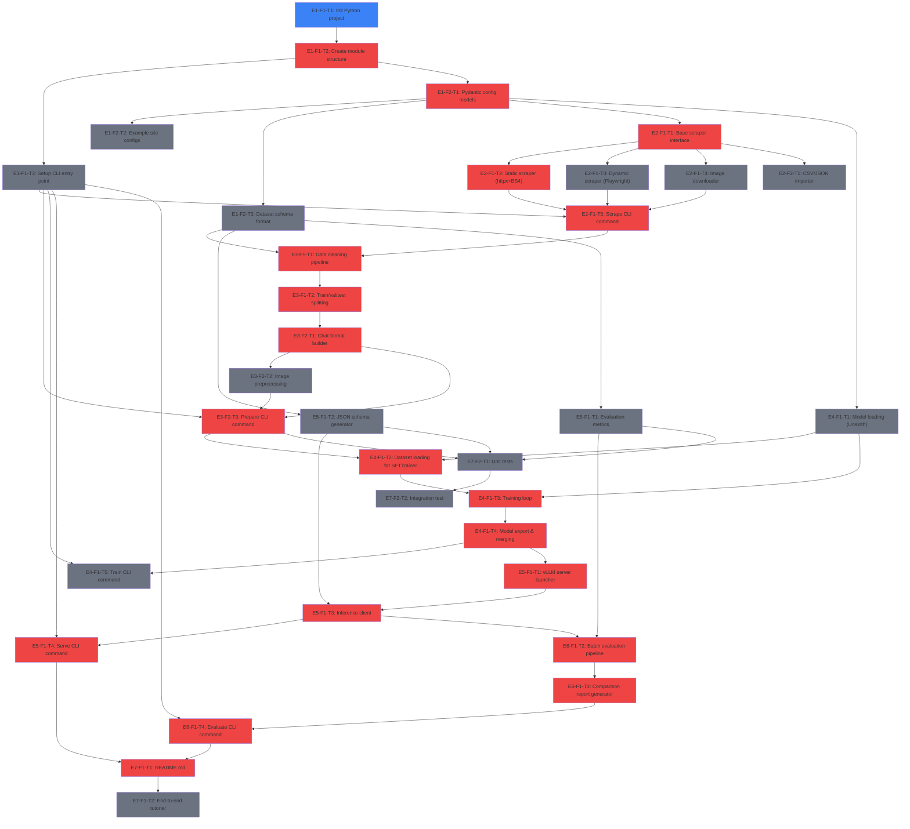

# ROADMAP.md

## Project Overview

**ArticleTagging** generalizes leboncoin's fine-tuning approach (from their article "How 1 hour of fine-tuning beat 3 weeks of RAG engineering") into a reusable pipeline that works with any dataset obtainable from web scraping. The system scrapes product listings, prepares training data, fine-tunes **Qwen3-VL-2B** with LoRA via Unsloth, serves with vLLM + guided JSON decoding, and evaluates with exact-match metrics. The repo is currently empty — this roadmap defines the full build.

## Dependency Graph

## Epics & Tasks

---

### E1: Project Setup & Configuration

#### E1-F1: Repository Structure & Packaging

##### 🔴 E1-F1-T1: Initialize Python project with pyproject.toml
- blocked_by: []
- status: ready
- effort: S
- agent_hint: Create `pyproject.toml` with `src/article_tagging/` layout. Dependency groups: `[core]` (pydantic>=2, pyyaml, click, rich, Pillow), `[scraping]` (scrapy, playwright, beautifulsoup4, httpx), `[training]` (unsloth, trl>=0.15, transformers, datasets, peft, bitsandbytes, accelerate, wandb), `[serving]` (vllm>=0.11, openai, fastapi, uvicorn), `[dev]` (pytest, ruff, mypy). Add `.gitignore` for Python/ML artifacts (checkpoints, `__pycache__`, `.env`, wandb, `data/`, `models/`).

##### 🔴 E1-F1-T2: Create package module structure
- blocked_by: [E1-F1-T1]
- status: pending
- effort: S
- agent_hint: Create `src/article_tagging/{scraping,dataset,training,inference,evaluation,cli}/__init__.py`. Create `configs/sites/` and `configs/schemas/` at repo root. Create gitignored `data/` and `models/` dirs.

##### E1-F1-T3: Setup CLI entry point with Click
- blocked_by: [E1-F1-T2]
- status: pending
- effort: S
- agent_hint: Create `src/article_tagging/cli/main.py` with `@click.group()` and subcommands: `scrape`, `prepare`, `train`, `serve`, `evaluate`. Each is a stub. Register as `article-tagging` console script in `pyproject.toml`. Use `rich` for output.

#### E1-F2: Configuration System

##### 🔴 E1-F2-T1: Design and implement Pydantic config models
- blocked_by: [E1-F1-T2]
- status: pending
- effort: M
- agent_hint: Create `src/article_tagging/configs/models.py`. Models: `SiteConfig` (name, base_url, listing_selector, detail_selectors dict, pagination, use_playwright, rate_limit), `DatasetConfig` (schema_path, split_ratio, text_only, system_prompt), `TrainingConfig` (model_name="Qwen/Qwen3-VL-2B-Instruct", load_in_4bit=True, lora_r=16, lora_alpha=32, target_modules, epochs=3, batch_size=1, gradient_accumulation_steps=8, learning_rate=2e-4, warmup_steps=50, eval_steps=100, early_stopping_patience=3), `ServingConfig` (model_path, gpu_memory_utilization=0.9, max_model_len=4096, port=8000), `EvalConfig`. All loadable from YAML via `load_config(path)`.

##### E1-F2-T2: Create example site config YAML templates
- blocked_by: [E1-F2-T1]
- status: pending
- effort: S
- agent_hint: Create 2 templates in `configs/sites/`: one for a simple e-commerce site, one fully-commented reference showing all options. Each maps to `SiteConfig`. Key principle: new site = new YAML, zero code.

##### E1-F2-T3: Create dataset schema definition format
- blocked_by: [E1-F2-T1]
- status: pending
- effort: S
- agent_hint: Create `configs/schemas/example.yaml` defining target attributes: `attributes: [{name, type: enum|string, values: [...], depends_on: optional}]`. This drives guided JSON decoding, validation, and eval. Dependencies are informational — the model learns them via fine-tuning.

---

### E2: Data Collection (Scraping)

#### E2-F1: Generic Scraper Framework

##### 🔴 E2-F1-T1: Implement base scraper interface and factory
- blocked_by: [E1-F2-T1]
- status: pending
- effort: M
- agent_hint: Create `src/article_tagging/scraping/base.py`. Abstract `BaseScraper` with `scrape_listings()`, `scrape_detail()`, `download_images()`. Dataclasses: `RawListing{url, title, image_urls, attributes}`. `ScraperFactory` picks static vs Playwright based on `SiteConfig.use_playwright`. Images saved to `data/raw/{site}/images/{id}/`.

##### 🔴 E2-F1-T2: Implement static site scraper (httpx + BeautifulSoup)
- blocked_by: [E2-F1-T1]
- status: pending
- effort: M
- agent_hint: `src/article_tagging/scraping/static_scraper.py`. Uses `httpx` + `BeautifulSoup`. CSS selectors from `SiteConfig.detail_selectors` (e.g., `{title: "h1.product-title", images: "div.gallery img@src", brand: "span.brand"}`). `@attr` suffix extracts attribute. Handles pagination (next-link or page-number pattern). Rate limiting from config.

##### E2-F1-T3: Implement dynamic site scraper (Playwright)
- blocked_by: [E2-F1-T1]
- status: pending
- effort: M
- agent_hint: `src/article_tagging/scraping/dynamic_scraper.py`. Playwright headless async. Reuse selector extraction via shared `extract_fields()` utility. Config: `wait_for_selector`, `scroll_to_bottom`. `playwright install chromium` in setup.

##### E2-F1-T4: Implement image downloader with deduplication
- blocked_by: [E2-F1-T1]
- status: pending
- effort: S
- agent_hint: `src/article_tagging/scraping/images.py`. Async `httpx` client, SHA256 dedup, manifest JSON, Pillow resize to `max_image_size` (default 1024px longest side). Handle broken URLs, 404s, timeouts.

##### 🔴 E2-F1-T5: Implement scrape CLI command and orchestrator
- blocked_by: [E2-F1-T2, E2-F1-T3, E2-F1-T4, E1-F1-T3]
- status: pending
- effort: S
- agent_hint: `src/article_tagging/scraping/orchestrator.py`. Loads `SiteConfig`, runs paginate -> scrape details -> download images -> save JSONL to `data/raw/{site}/listings.jsonl`. `asyncio.Semaphore` for concurrency. `--max-listings` flag. `rich` progress bars. Output: `{"id", "url", "title", "image_paths", "attributes"}`.

#### E2-F2: Data Import

##### ⚡ parallel group: A — E2-F2-T1: Implement CSV/JSON dataset importer
- blocked_by: [E2-F1-T1]
- status: pending
- effort: S
- agent_hint: `src/article_tagging/scraping/importers.py`. Import pre-existing CSV/JSON datasets (e.g., Kaggle, database exports) into the same JSONL format as the scraper. Small YAML mapping config for column-to-field mapping. Critical for users who already have labeled data and don't need to scrape.

---

### E3: Dataset Preparation

#### E3-F1: Data Cleaning & Validation

##### 🔴 E3-F1-T1: Implement data cleaning pipeline
- blocked_by: [E2-F1-T5, E1-F2-T3]
- status: pending
- effort: M
- agent_hint: `src/article_tagging/dataset/cleaning.py`. Normalize text (HTML entities, encoding, whitespace), validate attributes against schema YAML (drop invalid rows), deduplicate by title+attributes hash, filter missing images in multimodal mode. Log stats: total, dropped per reason, final count.

##### 🔴 E3-F1-T2: Implement train/validation/test splitting
- blocked_by: [E3-F1-T1]
- status: pending
- effort: S
- agent_hint: `src/article_tagging/dataset/splitting.py`. Stratified split (80/10/10 default) using sklearn `train_test_split`. Stratify by category field. Output: `data/processed/{name}/{train,val,test}.jsonl` + split stats JSON.

#### E3-F2: Chat Format Conversion

##### 🔴 E3-F2-T1: Implement chat-format conversation builder
- blocked_by: [E3-F1-T2]
- status: pending
- effort: M
- agent_hint: `src/article_tagging/dataset/formatter.py`. Core transformation from the article. Each record -> `{"messages": [{"role": "system", "content": "..."}, {"role": "user", "content": [{"type": "image", "image": "path"}, {"type": "text", "text": "Category: ...\nTitle: ...\nExtract: attr1, attr2"}]}, {"role": "assistant", "content": "{\"attr1\": \"val1\"}"}]}`. Support text-only mode (no image block). Configurable system prompt.

##### E3-F2-T2: Implement image preprocessing for training
- blocked_by: [E3-F2-T1]
- status: pending
- effort: S
- agent_hint: `src/article_tagging/dataset/image_processing.py`. Resize to max 1024px longest side, convert to RGB, handle CMYK/animated GIF (first frame), Pillow-based. Support file path ref (preferred, lazy loading) or base64 encoding. Qwen3-VL handles dynamic resolution natively.

##### 🔴 E3-F2-T3: Implement the prepare CLI command
- blocked_by: [E3-F2-T1, E3-F2-T2, E1-F1-T3]
- status: pending
- effort: S
- agent_hint: Wire `prepare` CLI: `--raw-data`, `--schema`, `--output-dir`, `--text-only`, `--split-ratio`. Pipeline: clean -> split -> format -> save as HuggingFace `Dataset` + JSONL copies. Print summary stats.

---

### E4: Fine-tuning Pipeline

#### E4-F1: LoRA Fine-tuning with Unsloth

##### ⚡ parallel group: B — E4-F1-T1: Implement model loading (Unsloth + 4-bit)
- blocked_by: [E1-F2-T1]
- status: pending
- effort: M
- agent_hint: `src/article_tagging/training/model.py`. `load_model(config)` using `FastVisionModel.from_pretrained("Qwen/Qwen3-VL-2B-Instruct", load_in_4bit=True)` then `FastVisionModel.get_peft_model(model, r=16, lora_alpha=32, target_modules=["q_proj","k_proj","v_proj","o_proj","gate_proj","up_proj","down_proj"])`. Use `gradient_checkpointing="unsloth"` for 8GB VRAM. Return (model, tokenizer). Support text-only models too.

##### 🔴 E4-F1-T2: Implement dataset loading for SFTTrainer
- blocked_by: [E3-F2-T3, E4-F1-T1]
- status: pending
- effort: M
- agent_hint: `src/article_tagging/training/data.py`. Load prepared HuggingFace Dataset, apply chat template via tokenizer, handle PIL image loading for multimodal. Use Unsloth's recommended data collator for vision models. Return train + eval datasets ready for SFTTrainer.

##### 🔴 E4-F1-T3: Implement training loop with SFTTrainer
- blocked_by: [E4-F1-T1, E4-F1-T2]
- status: pending
- effort: M
- agent_hint: `src/article_tagging/training/trainer.py`. `SFTTrainer` with `SFTConfig(num_train_epochs=3, per_device_train_batch_size=1, gradient_accumulation_steps=8, learning_rate=2e-4, warmup_steps=50, eval_strategy="steps", eval_steps=100, save_strategy="steps", save_steps=100, load_best_model_at_end=True)`. `EarlyStoppingCallback(patience=3)`. Save LoRA adapter to `models/{run}/`. Log with `rich` + optional W&B.

##### 🔴 E4-F1-T4: Implement model export and merging
- blocked_by: [E4-F1-T3]
- status: pending
- effort: S
- agent_hint: `src/article_tagging/training/export.py`. Save LoRA adapter separately via `model.save_pretrained()`. Merge into base via `model.save_pretrained_merged()` for standalone vLLM deployment. Save tokenizer alongside. Both FP16 merged and adapter-only modes.

##### E4-F1-T5: Implement the train CLI command
- blocked_by: [E4-F1-T4, E1-F1-T3]
- status: pending
- effort: S
- agent_hint: Wire `train` CLI: `--config`, `--dataset`, `--output-dir`, `--run-name`, `--wandb`. Flow: load config -> model -> data -> train -> export. Graceful CUDA OOM message suggesting batch_size=1 and gradient checkpointing.

---

### E5: Inference & Serving

#### E5-F1: vLLM Serving with Guided Decoding

##### 🔴 E5-F1-T1: Implement vLLM server launcher
- blocked_by: [E4-F1-T4]
- status: pending
- effort: M
- agent_hint: `src/article_tagging/inference/server.py`. Launch vLLM OpenAI-compatible server for Qwen3-VL-2B (FP16 or FP8, both fit 8GB). Config: `model_path`, `gpu_memory_utilization=0.9`, `max_model_len=4096`, `port=8000`. Support merged model or base+LoRA via `--enable-lora`. Exposes `/v1/chat/completions`.

##### ⚡ parallel group: C — E5-F1-T2: Implement guided JSON schema generator
- blocked_by: [E1-F2-T3]
- status: pending
- effort: S
- agent_hint: `src/article_tagging/inference/schema_generator.py`. Generate JSON Schema from dataset schema YAML for vLLM's `guided_json` param. Output: `{"type": "object", "properties": {"attr": {"type": "string", "enum": [...]}}, "required": [...]}`. Per-category schemas if multi-category. Ensures 99%+ valid output.

##### 🔴 E5-F1-T3: Implement inference client
- blocked_by: [E5-F1-T1, E5-F1-T2]
- status: pending
- effort: M
- agent_hint: `src/article_tagging/inference/client.py`. Async client using `openai.AsyncOpenAI(base_url="http://localhost:8000/v1")`. Builds chat messages (system + user with text/images as base64 data URLs), attaches `extra_body={"guided_json": schema}`. Parses JSON response. Handles timeouts/retries.

##### 🔴 E5-F1-T4: Implement the serve CLI command
- blocked_by: [E5-F1-T3, E1-F1-T3]
- status: pending
- effort: S
- agent_hint: `article-tagging serve --config serving.yaml` starts vLLM server. `article-tagging predict --title "..." --image photo.jpg --schema phones.yaml` does single prediction via client. Useful for demos and quick testing.

---

### E6: Evaluation & Benchmarking

#### E6-F1: Evaluation Metrics

##### ⚡ parallel group: C — E6-F1-T1: Implement exact match and per-attribute accuracy
- blocked_by: [E1-F2-T3]
- status: pending
- effort: S
- agent_hint: `src/article_tagging/evaluation/metrics.py`. `exact_match(preds, truth) -> float` (all attrs correct), `per_attribute_accuracy(preds, truth, attrs) -> dict`, `category_breakdown()`. Case-insensitive comparison. Return `EvalResult` dataclass. Exact match is the primary metric (per the article: partial predictions still need correction).

##### 🔴 E6-F1-T2: Implement batch evaluation pipeline
- blocked_by: [E6-F1-T1, E5-F1-T3]
- status: pending
- effort: M
- agent_hint: `src/article_tagging/evaluation/evaluator.py`. Load test JSONL, send each sample through inference client, collect predictions, compute metrics. `asyncio` with semaphore for concurrent requests. Save per-sample predictions for error analysis. Print `rich.table.Table` like the article's comparison tables.

##### 🔴 E6-F1-T3: Implement comparison report generator
- blocked_by: [E6-F1-T2]
- status: pending
- effort: S
- agent_hint: `src/article_tagging/evaluation/report.py`. Load multiple `EvalResult` JSONs, produce side-by-side Markdown table (like article's V0/V1/V2 table). Include exact match, per-category, per-attribute, deltas. Save to `reports/{name}.md`.

##### 🔴 E6-F1-T4: Implement the evaluate CLI command
- blocked_by: [E6-F1-T3, E1-F1-T3]
- status: pending
- effort: S
- agent_hint: `article-tagging evaluate --test-data ... --schema ... --server-url http://localhost:8000 --output-dir reports/`. `--compare-with` for comparison reports. Prints rich table and saves JSON + Markdown.

---

### E7: Documentation & Testing

#### E7-F1: Documentation

##### 🔴 E7-F1-T1: Write comprehensive README.md
- blocked_by: [E5-F1-T4, E6-F1-T4]
- status: pending
- effort: M
- agent_hint: Cover: project overview (link to leboncoin article), quick start (install, scrape, prepare, train, serve, evaluate), adding a new site (just add YAML), config reference, architecture diagram (Scrape -> Prepare -> Train -> Serve -> Evaluate), hardware requirements (8GB VRAM GPU, Qwen3-VL-2B). Emphasize ~200 examples per category as starting point.

##### E7-F1-T2: Write end-to-end tutorial
- blocked_by: [E7-F1-T1]
- status: pending
- effort: M
- agent_hint: `docs/tutorial.md`. Step-by-step with books.toscrape.com (safe scraping sandbox) or a CSV import. Show every pipeline stage with actual commands and expected output. Makes the project accessible to newcomers.

#### E7-F2: Testing

##### ⚡ parallel group: D — E7-F2-T1: Write unit tests for core modules
- blocked_by: [E3-F2-T3, E5-F1-T2, E6-F1-T1]
- status: pending
- effort: M
- agent_hint: `tests/test_config.py`, `tests/test_cleaning.py`, `tests/test_formatter.py`, `tests/test_schema_generator.py`, `tests/test_metrics.py`. Small inline fixtures, no large files. Focus on data transformations — most error-prone. Mock external deps.

##### E7-F2-T2: Write integration test for full pipeline
- blocked_by: [E7-F2-T1]
- status: pending
- effort: M
- agent_hint: `tests/test_integration.py`. Tiny synthetic dataset (10 samples). Real cleaning + formatting, mocked training + inference. Verify chat format structure, evaluation metrics computation. Catches integration issues between modules.

---

## Critical Path

🔴 **E1-F1-T1** -> **E1-F1-T2** -> **E1-F2-T1** -> **E2-F1-T1** -> **E2-F1-T2** -> **E2-F1-T5** -> **E3-F1-T1** -> **E3-F1-T2** -> **E3-F2-T1** -> **E3-F2-T3** -> **E4-F1-T2** -> **E4-F1-T3** -> **E4-F1-T4** -> **E5-F1-T1** -> **E5-F1-T3** -> **E5-F1-T4** -> **E6-F1-T2** -> **E6-F1-T3** -> **E6-F1-T4** -> **E7-F1-T1**

**20 sequential tasks on the critical path** (minimum delivery chain)

## Parallel Opportunities

| Group | Tasks | Can start after | Notes |
|-------|-------|----------------|-------|
| ⚡ A | E2-F2-T1 (CSV importer) | E2-F1-T1 | Parallel with E2-F1-T2, E2-F1-T3, E2-F1-T4 |
| ⚡ B | E4-F1-T1 (Model loading) | E1-F2-T1 | Parallel with entire E2+E3 scraping/dataset pipeline |
| ⚡ C | E5-F1-T2 (Schema gen) + E6-F1-T1 (Metrics) | E1-F2-T3 | Parallel with E2+E3+E4 — only need schema format |
| ⚡ D | E7-F2-T1 (Unit tests) | E3-F2-T3 + E5-F1-T2 + E6-F1-T1 | Parallel with E4 training pipeline |

**Key insight**: E4-F1-T1 (model loading), E5-F1-T2 (schema gen), and E6-F1-T1 (metrics) can all be built early in parallel with the scraping/dataset epics, significantly reducing wall-clock time.

## Done

*(none yet)*
